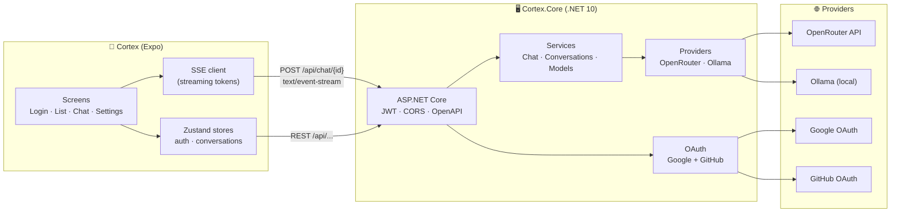

# Cortex

> A complete AI environment — chat, skills, memories, and code. Your main agent, or its helper.

Mobile-first app (Expo + .NET) that talks to multiple LLM providers (OpenRouter, Ollama — direct connectors coming) through its own backend with OAuth authentication (Google + GitHub), JWT, and SSE streaming. The goal: manage all your AI context — skills, memories, indexed code — on mobile and desktop, working as your main agent or as a helper to other agents. Offline is free for non-commercial use; cloud sync will be a subscription. See [docs/ROADMAP.md](./docs/ROADMAP.md) for the full plan.


## Architecture



## Stack

- **Backend**: .NET 10, ASP.NET Core, EF Core 10, PostgreSQL 17, JWT, OpenAPI
- **Frontend**: Expo SDK 56, React 19, React Native 0.85, expo-router (typed routes), styled-components, Reanimated 4, Zustand, expo-secure-store, react-native-markdown-display, react-native-gesture-handler
- **Infra**: Docker Compose (Postgres), EAS Build (dev build)

## Structure

```
Cortex/
├── Cortex.Core/              # .NET backend
│   ├── Controllers/          # Auth, Me, Conversations, Models, Chat
│   ├── Services/             # AuthService, ChatService, OAuthService...
│   ├── Providers/            # IProvider, OpenRouterProvider, OllamaProvider
│   ├── Data/                 # AppDbContext
│   ├── Objects/              # Domain entities
│   ├── Auth/                 # JWT options, CurrentUser
│   └── Dtos/                 # Request/response records
└── CodePlus/                 # Expo frontend (to be renamed)
    ├── app/                  # expo-router routes
    │   ├── (tabs)/           # Home + future tabs
    │   ├── conversation/     # [id] chat + new picker
    │   ├── login.tsx
    │   ├── callback.tsx
    │   └── settings.tsx
    ├── api/                  # HTTP client + SSE + typed endpoints
    ├── components/           # ui/ chat/ sheets/ feedback/ markdown/
    ├── stores/               # authStore, conversationsStore
    ├── theme/                # colors, motion, ThemeProvider
    └── config/               # env-driven runtime config
```

## Design Decisions

- **Backend as the single proxy**: OpenRouter/Ollama keys never touch the client. The frontend is stateless.
- **Server-side persistence**: conversations/messages live in Postgres. The app keeps only the JWT + theme preference.
- **SSE over POST**: token streaming via `text/event-stream`, read in the app through fetch's native `ReadableStream`.
- **Gray-first theme**: grayscale palette with a white variant; consistent accent across modes.
- **Intentional animations** (Emil Kowalski philosophy): buttons with `scale(0.97)` on press, bubbles with staggered entrance (45ms), BottomSheet with damping + velocity-based dismiss, toasts entering/exiting in the same direction via interruptible transitions.

## Roadmap

- [x] **Phase 1**: Chat app (mobile + backend)
- [ ] **Phase 2**: Provider layer (model picker, direct connectors, BYOK, routing) ← _we are here_
- [ ] **Phase 3**: Context engine (memories, skills, code indexing, RAG, MCP)
- [ ] **Phase 4**: Agent mode (tools, orchestration, helper mode, automations, A2A)
- [ ] **Phase 5**: Desktop + Cloud (desktop app, E2E sync, subscription)

Full backlog with per-phase tasks: [docs/ROADMAP.md](./docs/ROADMAP.md).

## License

See [LICENSE](./LICENSE).
